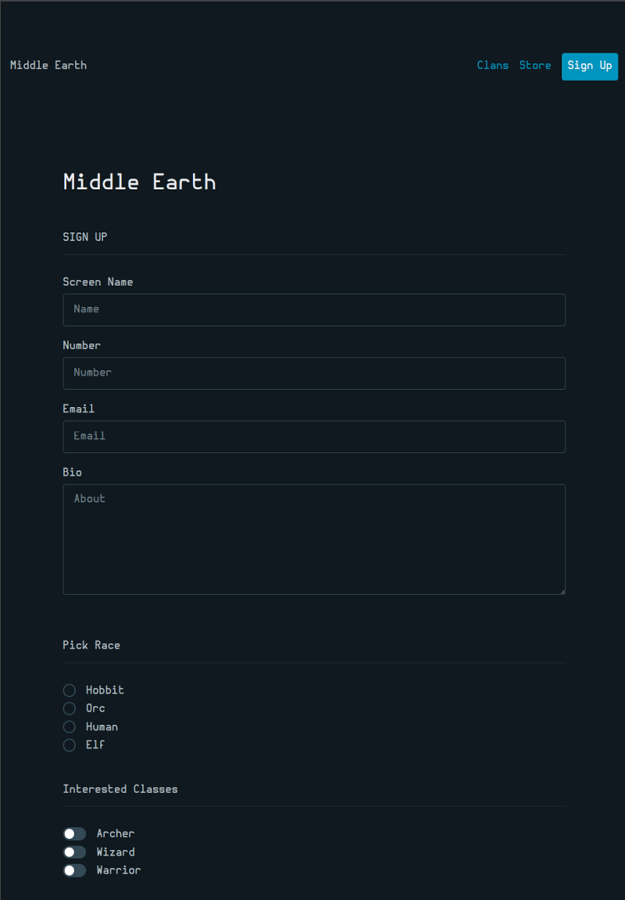

<div align="center">

<h1>Picocss</h1>
<br/>
</div>
<h3>What is this all about?</h3>
Just testing out Picocss, decided to make a form.
<h3>Anything Important Learned</h3>
I suppose the most important thing is you need a bundler if you're using as a npm install.
<br>
I decided to use Parceljs.
<h3> Setting up a vanilla js project </h3>
```
$ mkdir project-name & cd project
$ touch index.html style.css app.js .gitignore
    -> add node_modules, parcel-cache, dist/ to gitignore
$ npm install @picocss/pico
$ npm install -D parcel
```
Be sure to include js script in html or it wont work.
<br/>
Javascript file should import picocss <br/>
```javascript
//app.js
import '@picocss/pico'
```
<br/>
Now you can run Parcel and view in browser<br/>
`$npx parcel`

